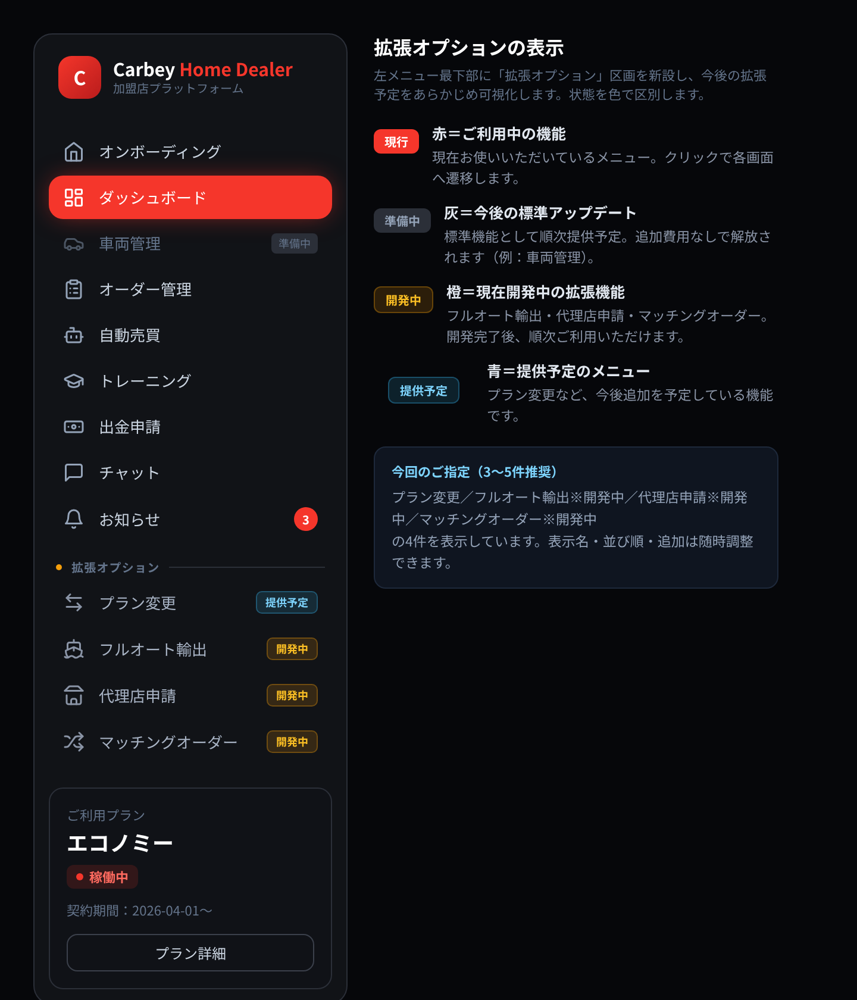

# 拡張オプション ご案内・拡張プロセス書面

版：Version 1.0
作成日：2026-07-26
対象：カーベイ FC 加盟店プラットフォーム（Home Dealer）

> 本書は、左メニューに新設する「**拡張オプション**」区画の表示イメージと、拡張機能をご利用いただくまでの**流れ・費用の考え方・期間の目安・ご準備いただくもの**をまとめたものです。

---

## 1. 左メニュー「拡張オプション」区画（表示モック）

左メニューの最下部に「拡張オプション」区画を新設し、将来ご利用いただける機能を**あらかじめ可視化**します。「どんな拡張ができるか」がひと目で分かり、ご希望の機能をそのままお申し込みいただける導線です。

### 表示は状態ごとに色で区別します

| 表示 | 色 | 意味 | 費用 |
|---|---|---|---|
| **現行** | 赤 | 現在ご利用中のメニュー（クリックで各画面へ） | プラン内 |
| **準備中** | 灰 | 今後の標準アップデートで解放される機能 | 追加費用なし |
| **開発中** | 橙 | 現在開発中で、完了後に順次提供する拡張機能 | 個別お見積り |
| **提供予定** | 青 | 今後追加を予定しているメニュー | 個別お見積り |

- 「開発中」「提供予定」の項目をクリックすると、**機能の概要と「相談する」ボタン**が表示されます（申込みだけで即課金は発生しません）。
- 表示する機能・並び順は、貴社のご要望に合わせて調整可能です。表示は多すぎない範囲（**3〜5件程度**）を推奨します。

---

## 2. 左メニューに表示する拡張オプション（ご指定分）

貴社よりご指定いただいた、今後の拡張予定を左メニューに表示します（上記モック参照）。各機能の詳細仕様は、要件整理・お見積り時に確定します。

| 機能 | 概要（高レベル） | 状態 |
|---|---|---|
| プラン変更 | ご利用プランの変更申請・切替 | 提供予定 |
| フルオート輸出 | 輸出販売に対応した自動売買の拡張 | 開発中 |
| 代理店申請 | 代理店としての申請・登録 | 開発中 |
| マッチングオーダー | 条件に基づくオーダーの自動マッチング | 開発中 |

> ※表示名・並び順・表示件数は随時調整できます。上記以外の機能を追加したい場合もご相談ください。

---

## 3. 拡張の依頼〜提供プロセス

拡張機能は、以下の流れで進めます。**内容・費用・期間にご承認をいただいてから着手**しますので、ご想定外の費用が発生することはありません。

| ステップ | 内容 | 主担当 |
|---|---|---|
| ① ご相談 | メニューの「相談する」またはチャットからご依頼。実現したいことをお伝えいただきます | 加盟店 |
| ② 要件整理 | 内容をヒアリングし、機能範囲・仕様を整理します | 本部／開発 |
| ③ お見積り | 費用・期間・ご準備物を書面でご提示します | 開発 |
| ④ ご承認 | 内容・費用にご同意いただき、正式発注 | 加盟店 |
| ⑤ 開発 | 設計・実装。必要に応じて途中経過を共有します | 開発 |
| ⑥ 動作確認 | テスト環境でご確認いただきます | 加盟店／開発 |
| ⑦ リリース | 本番環境へ反映し、メニューを有効化します | 開発 |
| ⑧ ご利用開始 | 操作方法をご案内し、運用開始 | 本部 |

---

## 4. 費用の考え方

- 拡張機能は、当初お見積り範囲および月額保守（軽微な修正）には**含まれない追加開発**です。
- 費用は**機能ごとの個別お見積り**とし、③の段階で書面にてご提示します。
- **ご承認前に着手・課金することはありません。** 小規模な調整か、大規模な開発かによって費用・期間は変動します。
- 継続的な運用費（利用料・保守）が発生する機能は、その旨も併せてご提示します。

---

## 5. 期間の目安

規模により異なりますが、目安は以下の通りです（正確な期間は③お見積り時にご提示します）。

| 規模 | 例 | 目安 |
|---|---|---|
| 小 | 表示項目・帳票の追加、軽微な画面調整 | 数日〜1週間程度 |
| 中 | 1機能の新規追加（例：スタッフ管理、陸送費見積） | 2〜4週間程度 |
| 大 | 業務フロー全体の自動化・外部システム連携 | 1〜数ヶ月程度 |

---

## 6. 加盟店側でご準備いただくもの

スムーズに進めるため、拡張内容に応じて以下をご用意ください（該当するもののみ）。

- **実現したい業務・運用のイメージ**（現状の課題、こうしたいという要望）
- **対象データ・帳票のサンプル**（例：陸送費表、見積書式、契約書式）
- **連携先の情報**（外部システム連携の場合：サービス名・アカウント・API資料など）
- **社内の承認・確認担当者**（動作確認や仕様判断をお願いする窓口）
- **ご希望の公開時期**（キャンペーン等、期日がある場合）

---

## 7. ご確認いただきたい事項

左メニューに表示する拡張オプションは、貴社ご指定の4件（第2章）で確定いたしました。以下について、追加でご希望があればお知らせください。

1. **表示名・並び順**（現状は第2章の順で表示。変更のご希望があれば）
2. 現時点で**優先して開発・ご相談されたい機能**（例：フルオート輸出を先行 など）
3. 各機能の**詳細仕様・想定運用**（要件整理の起点として、イメージがあれば）

---

*本書は Ver 1.0 です。表示機能の追加・プロセスの更新に応じて改訂します。*
